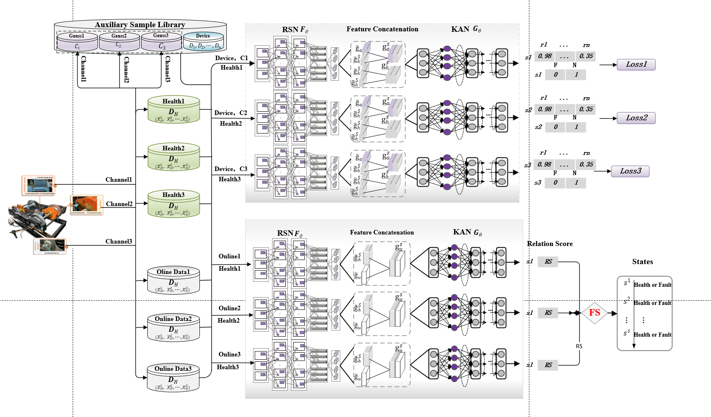

# PRN method
### "It's my first paper! I love it so much!"   
Let me give a simple introduction to the artical. With all my codes.   
Here's the `pdf` of the artical: [PRN-20240829.pdf](PRN-20240829.pdf)   
## Parallel relation network for fault detection of train transmission systems with zero-fault sample  
In this artical, we proposed such a method for Beijing PHM 2024 conference   
## Model structure   
This model mainl contains 3 part:   
### Residual Shrinkage Network  
The **RSN** is designed to extraction the high-quality features by itself from time-frequency images. Unlike ResNets, RSN adds a soft threshold as a nonlinear adjustment layer. This layer effectively removes noise-related information, thereby extracting meaningful features.       
### Feature Splicing   
In order to describe the similarity of features between samples, we established the concept of sample pairs. In the feature concatenation module, features from different source samples are concatenated together as sample pairs.      
### Kolmogorov-Arnold Relation Networks   
In the KARN module, we use **Kolmogorov-Arnold Networks (KAN)** to serve as relation networks. KAN is an innovative neural network architecture that proposes an alternative to the traditional multilayer perceptron (MLP).     
  

<strong>Model structure of PRN
 

## Auxiliary Sample Library (ASL)  
  An ASL is constructed to help extract high level features. Samples in this lib are generated by the soft Brownian offset method.  To know more about this method, you can read this artical: **[Out-of-distribution Detection and Generation using Soft Brownian Offset Sampling and Autoencoders](2105.02965)**
## Dataset  
Datasets are not included cause it's too large  
You can download it on conference website: https://www.icphm.org  

<strong>Official Website for PHM 2024
  

### Actually those code sucks(not so clean), but they're truly useful

